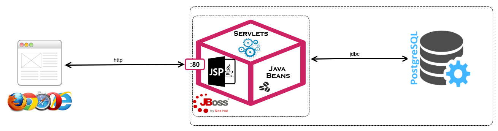
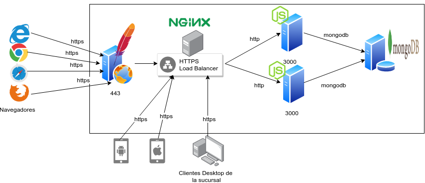
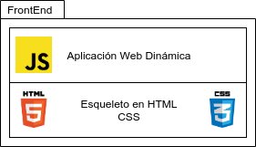
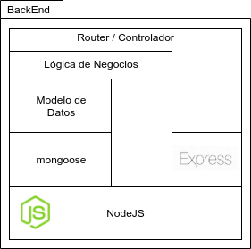
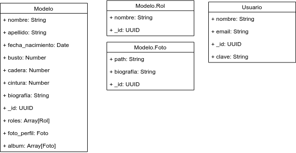
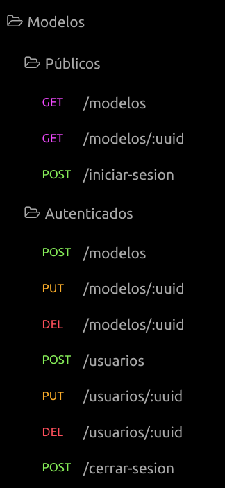

# Ejercicio de Diseño de Arquitectura

## Situación Actual.

Una agencia de modelos exitosa cuenta con un sistema altamente concurrido, que fue diseñado usando un modelo monolítico.
En su arquitectura actual, un servidor contiene una aplicación web de acceso público que permite ver todas las modelos de la agencia con su respectivo portafolio de fotos y que tiene además un login que permite el acceso privado vía credenciales a una sucursal de marketing de la agencia para crear, borrar o modificar las fotos y datos de las modelos.

Alguno de los problemas actuales de éste modelo son:

* Dado que la página es altamente concurrida y que las fotos son de buena calidad, los usuarios de la página experimentan constantemente mucha latencia y time out, a partir de las 600 conexiones concurrentes.
* La BD actual, utiliza un modelo relacional en postgres. Cómo la empresa aún se encuentra en etapa de crecimiento, se avecinan muchos cambios, para lo que el modelo relacional podría no adaptarse lo suficientemente rápido. La flexibilidad del modelo es actualmente un problema.
* El código no es mantenible a largo plazo, dado que la aplicación está escrita en Java EE, utilizando JSPs para la capa de presentación y los Servlets para la lógica de negocio. Un cambio en la capa de presentación implica que todo el código debe pasar por la compilación, generación del WAR/EAR, la fase de test y el deploy, ésto también implica la pérdida de sesión de todos los clientes internos que se encuentran conectados al sitio.
* La agencia no cuenta con ninguna aplicación móvil actualmente, pero es algo que se prevé a futuro, y dado el modelo actual, la lógica de negocios no puede ser reutilizada.
* Además de ésto, muchos clientes externos se quejan de que los navegadores indican que el sitio no es seguro.

La imagen abajo describe la arquitectura actual:

El gerente de TI de la agencia desea tercerizar el proyecto y le solicita a usted que presente una propuesta de arquitectura, con las restricciones y posibilidades siguientes:

*Restricciones:*

* El tráfico de la página pública irá en aumento, por lo que la arquitectura debe permitir robustecer los servidores necesarios a futuro en caso de que el tráfico se duplique o triplique.
* La capa de presentación sufrirá de cambios constantes, dado que está también previsto que mensualmente el layout de la aplicación cambie en función de la modelo más votada, u otras cuestiones de marketing. Eso no solo incluye las imágenes de fondo de la aplicación, sino también el CSS, y el esqueleto del sitio.
* La nueva arquitectura debe prever la existencia de aplicaciones móviles nativas (Android e iOS) para clientes normales y usuarios especiales que deben usar la misma plataforma lógica que el sitio web.
* La sucursal de la agencia, debe seguir teniendo acceso a la página, pero a una sección privada y protegida.
* Los clientes ya no debería ver el error de que la página no es segura.

*Possibilidades:*

* Es posible definir un proceso de migración de datos y de fotografías a un nuevo motor de BD, por lo que se puede reemplazar la arquitectura existente.
* Es posible utilizar la tecnología que mejor se adapte para deployar la capa de presentación y lógica de negocios.
* La empresa está dispuesta a costear hasta 4 servidores inicialmente, incluyendo el de la BD.

## Ejercicios

### 1. Defina una arquitectura

La arquitectura debe contemplar todas las restricciones y posibilidades definidas en la sección precedente.

Realice un diagrama que ejemplifique tal modelo y asegúrese de especificar los protocolos utilizados, los puertos, la tecnología, el lugar dónde se encontrará cada capa de la aplicación, los servicios y los clientes que consumiran tales capas.

Tenga en cuenta que muchas son las soluciones posibles, pero cada elección `DEBE` estar justificada.

### 2. Defina el modelo de datos

Teniendo en cuenta los siguientes datos diseñe su modelos de datos:

Datos adicionales:

* En la pantalla principal el sitio debe mostrar la lista de modelos con sus fotos de perfil y con un filtro que permita seleccionar el o los roles deseados.
* Cada modelo puede tener uno o varios roles: modelo profesional, promotora, influencer o presentadora. Los roles podrían ir aumentando a medida que los clientes requiran más perfiles.
* Cuando el cliente hace click en alguna de las fotos, el sitio debe ir a una pantalla que muestre todos los datos de la modelo seleccionada (nombre, apellido, edad, medidas, biografía). En ésta página también el cliente debe poder ver el portafolio (todas las fotos) completo de la modelo.
* La sucursal de marketing debe poder tener credenciales asignadas para tener permisos de edición de las modelos (Eliminar una modelo que no ha renovado contrato, actualizar los datos de la modelo, agregar o borrar fotos, agregar eventualmente nuevos roles).
* El sitio también debe tener un sitio admin que permita crear tales usuarios, mínimamente con los datos siguientes datos; nombre de usuario, contraseña y dirección de correo.

Su modelo de datos debe contener, las tablas o documentos, las relaciones entre ellas si existiese, también los atributos de cada tabla, las claves primarias y secundarias.
(No es necesario incluir una tabla de privilegios de usuarios, esto puede ser omitido)

### 3. Defina el modelo de servicios

Dados los datos adicionales descriptos en el ejercicio anterior, también defina un modelo de servicios.

Tenga en cuenta que existen 2 niveles de seguridad en los servicios:

* De acceso público
* De acceso restringido (protegido por un proceso de autenticación y autorización)

Su modelo de servicios debe describir cada servicio y contener todos los métodos permitidos, indicando a qué nivel de seguridad cada servicio debe ser expuesto.

## Solución

### 1. Definición de la arquitectura

Para solucionar las necidades del cliente se plantea una arquitectura que separe el front-end del back-end, haga uso de balanceadores de carga y bases de datos NoSQL, además del uso de protocolos HTTPS en servidores que estén expuestos.

#### Infraestructura

Se proponen los siguientes servidores en la arquitectura:

* Un servidor Web Apache que sirva el front end de la aplicación web vía HTTPS en el puerto seguro 443.
* Un servidor de balanceo de carga Nginx que sirva la API REST para los demas clientes, también en el puerto HTTPS 443.
* Un par de servidores usando NodeJS, cada uno sirviendo la misma API REST que consumen los clientes web, móviles y los usuarios privados de la sucursal, escuchando en el puerto 3000 (o cualquier otro puerto) en http plano. Se puede escalar fácilmente agregando un servidor más (escalamiento vertical) o más recursos (escalamiento horizonal) a cada uno de los servidores, lo que sea más barato en el momento.
* Un servidor de bases de datos no relacional  Mongo DB, que se adapte rápido a los cambios del negocio, usando bases de datos orientadas a documentos.

#### Front-End

El front-end es una aplicación Web dinámica basada en HTML/CSS y JavaScript, está separada de la lógica de negocios y se puede modificar con tranquilidad mientras el back-end sigue sirviendo a usuarios móviles y a los usuarios privados de la empresa vía endpoints REST.

Cualquier modificación por compleja que sea en la interfaz gráfica no afecta a la lógica de negocios ni a los demas clientes de la API REST.

#### Back-End

El back-end esta compuesto por una aplicación NodeJS + express framework y la biblioteca de acceso de datos mongoose, permite definir modelos de datos libremente en JavaScript y guardarlos en una base de datos mongoDB sin tener que preocuparse por los cambios del modelo de datos, está separado en capas, de Modelo de Datos, Lógica y de Negocios y Controlador REST.

### 2. Modelo de datos

Dado que optamos por mongoDB, no es necesario crear relaciones y según lo especificado el modelo de datos implica un esquema como el que sigue:

Los documentos de `Rol` y `Foto`, están embebidos en el documento `Modelo`, pero el modelo Usuario si es un recurso independiente.

### 3. Servicios REST necesarios

Los servicios disponibles son los siguientes, clasificados por autenticados y publicos.

